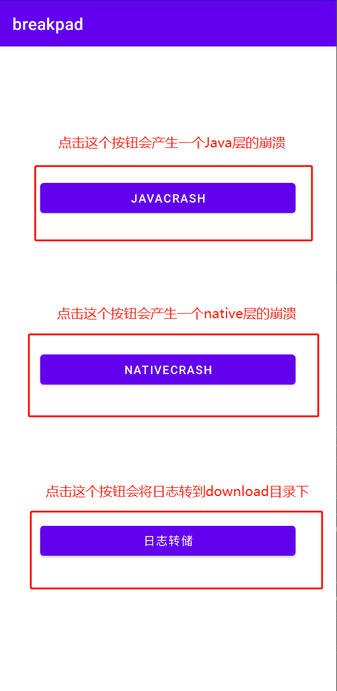
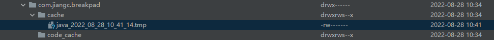
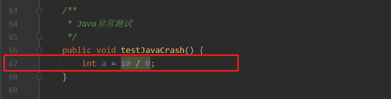
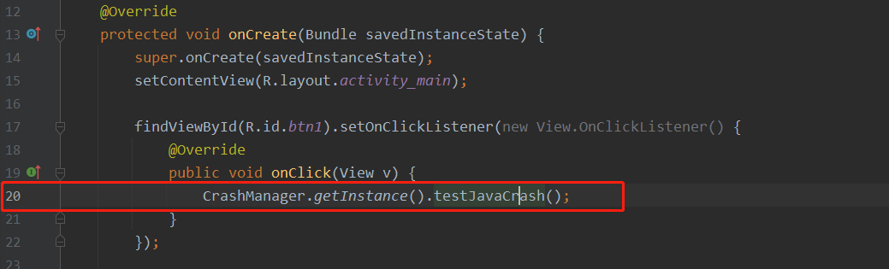
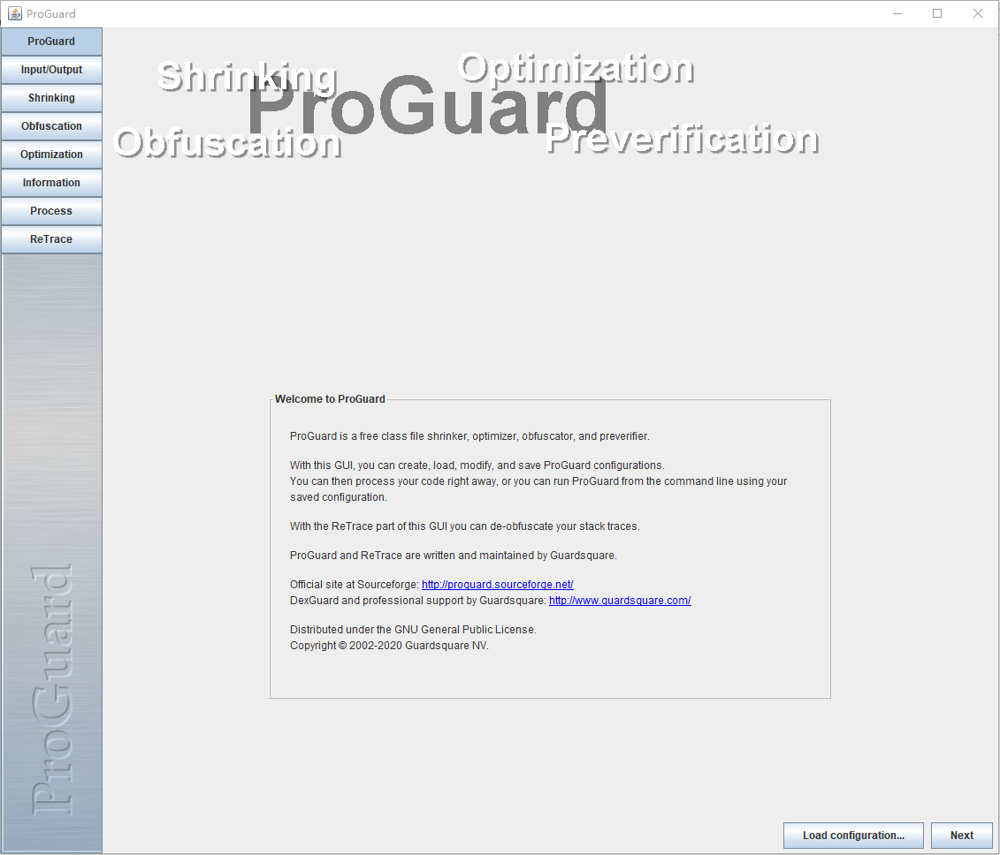
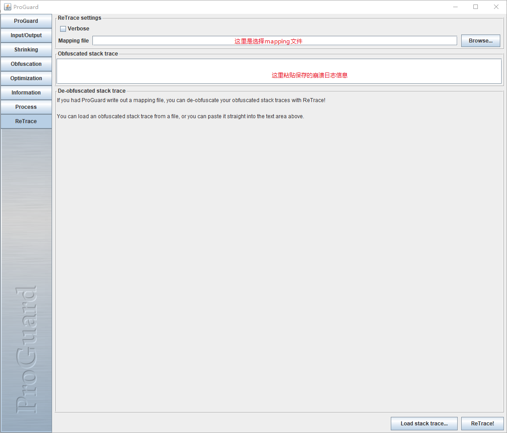
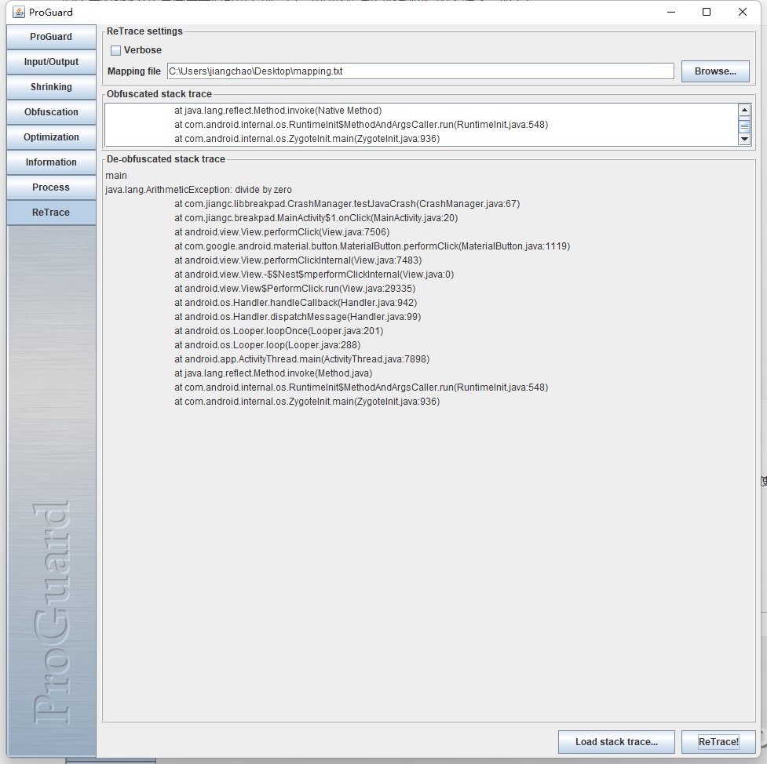
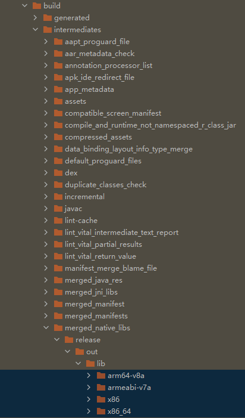
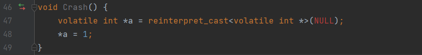

# CrashManager 使用说明


[TOC]

简介： CrashManager 模块可监控Java端未捕获的异常以及Native未捕获的异常，捕获日志默认保存在app内部存储空间中 /data/data/app package/catch/

文件名：java_xxxx_xx_xx_xx_xx_xx.tmp  

​              native_xxxx_xx_xx_xx_xx_xx.dmp

#### 一. 基本使用

直接将libbreakpad-release.aar文件放到 工程的libs目录,并在 app下的build.gradle中引用，如下：

```groovy
implementation(files('libs/libbreakpad-release.aar'))
```

然后在Application中进行初始化

```java
public class MyApplication extends Application {
    @Override
    public void onCreate() {
        super.onCreate();
        // 异常捕获模块初始化
        CrashManager.getInstance().init(this);
        // 将文件从catch目录中转存到Download目录中(可选,需要手动分析的时候加上这句)
        CrashManager.saveStackToDownload(this);
    }
}
```

然后运行程序demo如下所示：



点击JAVACRASH按钮会产生一个Java层的崩溃：

```shell
2022-08-28 18:41:14.486 7738-7738/com.jiangc.breakpad E/AndroidRuntime: FATAL EXCEPTION: main
    Process: com.jiangc.breakpad, PID: 7738
    java.lang.ArithmeticException: divide by zero
        at com.jiangc.libbreakpad.CrashManager.testJavaCrash(CrashManager.java:67)
        at com.jiangc.breakpad.MainActivity$1.onClick(MainActivity.java:20)
        at android.view.View.performClick(View.java:7506)
        at com.google.android.material.button.MaterialButton.performClick(MaterialButton.java:1119)
        at android.view.View.performClickInternal(View.java:7483)
        at android.view.View.-$$Nest$mperformClickInternal(Unknown Source:0)
        at android.view.View$PerformClick.run(View.java:29335)
        at android.os.Handler.handleCallback(Handler.java:942)
        at android.os.Handler.dispatchMessage(Handler.java:99)
        at android.os.Looper.loopOnce(Looper.java:201)
        at android.os.Looper.loop(Looper.java:288)
        at android.app.ActivityThread.main(ActivityThread.java:7898)
        at java.lang.reflect.Method.invoke(Native Method)
        at com.android.internal.os.RuntimeInit$MethodAndArgsCaller.run(RuntimeInit.java:548)
        at com.android.internal.os.ZygoteInit.main(ZygoteInit.java:936)
2022-08-28 18:41:14.491 7738-7738/com.jiangc.breakpad E/JavaCrashMonitor: renameFile: /data/user/0/com.jiangc.breakpad/cache/java_2022_08_28_10_41_14.tmp
```

应用程序崩溃后会在catch目录下生成相关的崩溃日志文件



应用程序可根据实际情况进行上传或其他处理,也可以手动打开分析

#### 二. 测试代码

java 测试异常代码

```java
    /**
     * 异常测试
     */
    public void testJavaCrash() {
        int a = 10 / 0;
    }
```

native 测试异常代码

```c++
void Crash() {
    volatile int *a = reinterpret_cast<volatile int *>(NULL);
    *a = 1;
}
```


#### 三. 异常定位

##### 2.1 Java

###### 2.1.1 未混淆

​	直接双击打开查看相关日志即可，当然，如果我们是线下也可以直接在Android studio中看到，如下:

```java 
main   // 所在线程
java.lang.ArithmeticException: divide by zero    // 崩溃的原因
	at com.jiangc.libbreakpad.CrashManager.testJavaCrash(CrashManager.java:67)// 崩溃的地方
	at com.jiangc.breakpad.MainActivity$1.onClick(MainActivity.java:20)       // 调用的地方
	at android.view.View.performClick(View.java:7506)
	at com.google.android.material.button.MaterialButton.performClick(MaterialButton.java:1119)
	at android.view.View.performClickInternal(View.java:7483)
	at android.view.View.-$$Nest$mperformClickInternal(Unknown Source:0)
	at android.view.View$PerformClick.run(View.java:29335)
	at android.os.Handler.handleCallback(Handler.java:942)
	at android.os.Handler.dispatchMessage(Handler.java:99)
	at android.os.Looper.loopOnce(Looper.java:201)
	at android.os.Looper.loop(Looper.java:288)
	at android.app.ActivityThread.main(ActivityThread.java:7898)
	at java.lang.reflect.Method.invoke(Native Method)
	at com.android.internal.os.RuntimeInit$MethodAndArgsCaller.run(RuntimeInit.java:548)
	at com.android.internal.os.ZygoteInit.main(ZygoteInit.java:936)
```

崩溃代码信息: CrashManager.java   Java Crash是发生在  67行  除0异常



MainActivity.java   Java 崩溃日志是在  20行，调用了上图中的方法



###### 2.1.2 混淆

代码混淆后会产生mapping文件(需要配置),在混淆规则文件中加入如下语句

```properties
# dump.txt文件列出apk包内所有class的内部结构
-dump class_files.txt
# seeds.txt文件列出未混淆的类和成员
-printseeds seeds.txt
# usage.txt文件列出从apk中删除的代码
-printusage unused.txt
# mapping.txt文件列出混淆前后的映射
-printmapping mapping.txt
```

之后在 app/build/outputs/mapping/release 下面会生成相关文件,最主要的就是mapping.txt 


混淆后的app产生异常后我们可以看到，显示出错的行数已经和实际的不对了，如下：

```java
2022-08-28 19:06:41.470 9338-9338/? E/AndroidRuntime: FATAL EXCEPTION: main
    Process: com.jiangc.breakpad, PID: 9338
    java.lang.ArithmeticException: divide by zero
        at com.jiangc.libbreakpad.CrashManager.testJavaCrash(Unknown Source:2)
        at com.jiangc.breakpad.MainActivity$a.onClick(Unknown Source:4)
        at android.view.View.performClick(View.java:7506)
        at com.google.android.material.button.MaterialButton.performClick(MaterialButton.java:2)
        at android.view.View.performClickInternal(View.java:7483)
        at android.view.View.-$$Nest$mperformClickInternal(Unknown Source:0)
        at android.view.View$PerformClick.run(View.java:29335)
        at android.os.Handler.handleCallback(Handler.java:942)
        at android.os.Handler.dispatchMessage(Handler.java:99)
        at android.os.Looper.loopOnce(Looper.java:201)
        at android.os.Looper.loop(Looper.java:288)
        at android.app.ActivityThread.main(ActivityThread.java:7898)
        at java.lang.reflect.Method.invoke(Native Method)
        at com.android.internal.os.RuntimeInit$MethodAndArgsCaller.run(RuntimeInit.java:548)
        at com.android.internal.os.ZygoteInit.main(ZygoteInit.java:936)
2022-08-28 19:06:41.472 9338-9338/? E/JavaCrashMonitor: renameFile: /data/user/0/com.jiangc.breakpad/cache/java_2022_08_28_11_06_41.tmp
```

 虽然这里我们还能看到相关函数，但很多情况下是看不到的，那么就需要使用mapping文件和官方提供的工具进行还原

混淆后异常定位：

使用Android studio 自带的proGuard(**最好在官方下载最新版，自带的可能会解不出来**)工具以及mapping文件进行日志解密，使用如下：

Android studio proGuard路径：Android/Sdk/tools/proguard/bin/proguardgui.bat 

文中使用的是从 https://github.com/Guardsquare/proguard/releases/download/v7.2.1/proguard-7.2.1.zip 下载的

双击 proguardgui.bat  打开，看到如下界面:



点击左边菜单  ReTrace 按钮:



在选择好mapping文件以及粘贴好崩溃日志后，点击右下角ReTrace按钮：如下图：



结合上面代码异常的地方，是可以一一对应的，到此还原了Java端混淆后日志解密工作。

##### 2.2 native

###### 2.2.1 未混淆

对于native来讲，拿到的日志都需要minidump_stackwalk去解析，解析完了之后找到对应架构的so库结合崩溃的地址然后找到崩溃的地方,参考下面2.2.2章节讲解的方式。

###### 2.2.2 混淆

前提条件：需要保存未stripped调试信息的so库，在发布一个版本之前保存改版本的so库，以便在崩溃时定位崩溃信息

不同版本的Android studio 存放位置不同，当前版本为: Bumblebee  ，调试so存放在   build/intermediates/merged_native_libs 下面




native崩溃代码：向空指针写数据,函数名为Crash，崩溃的行号应该在48行，在下面我们通过解密崩溃日志来定位到这里



在app崩溃后同Java一样导出相关日志，分析步骤如下：

1. 找到Android studio 自带的工具：Android studio/bin/lldb/bin/minidump_stackwalk.exe   （Bumblebee 版本的Android studio好像没有了，可以自己编译或者网上下载，下面会给出相关的下载地址）
2. 将dmp日志导出为txt
3. 通过保存的未stripped的so定位崩溃位置

命令： minidump_stackwalk.exe  native_2022_02_25_11_24_14.dmp > crash.txt

crash.txt 的基本内容：

```c
Operating system: Android          // 操作系统
                  0.0.0 Linux 5.15.41-android13-8-00205-gf1bf82c3dacd-ab8747247 #1 SMP PREEMPT Sun Jun 19 02:44:07 UTC 2022 x86_64                            // 崩溃的指令集, 后面需要根据这个去找同指令集的addr2line工具去定位
CPU: amd64               
     family 6 model 6 stepping 3
     4 CPUs              // CPU核心数

GPU: UNKNOWN

Crash reason:  SIGSEGV /0x00000000        // 崩溃的原因 SIGSEGV
Crash address: 0x0                        // 崩溃的地址(有时候是0，主要看后面的)
Process uptime: not available 

Thread 0 (crashed)
 0  libcrash.so + 0x16260                // 这里我们看到 是哪个库崩溃的,以及后面的地址,这个地址是我们需要的
    rax = 0x000073c7aed68260   rdx = 0x0000000000000000
    rcx = 0x0000000000000000   rbx = 0x0000000000000010
    rsi = 0x00007ffde9eb15a8   rdi = 0x000073c880562ed0
    rbp = 0x00007ffde9eb14d0   rsp = 0x00007ffde9eb14b8
     r8 = 0x000073c7bfb4d1a0    r9 = 0x0000000000000001
    r10 = 0xffffffffffffff22   r11 = 0x000073ca756eb150
    r12 = 0x000073c75106d23c   r13 = 0x00007ffde9eb15c8
    r14 = 0x000073c7bf360600   r15 = 0x00007ffde9eb15c0
    rip = 0x000073c7aed68260
    Found by: given as instruction pointer in context
 1  libart.so + 0x1e28c
    rbp = 0x00007ffde9eb14d0   rsp = 0x00007ffde9eb14c0
    rip = 0x000073c7bf37d28c
    Found by: stack scanning
 2  base.vdex + 0x25623c
    rsp = 0x00007ffde9eb1570   rip = 0x000073c75106d23c
    Found by: stack scanning
 3  base.vdex + 0x25623c

```


我们通过addr2line工具解析崩溃原因，addr2line工具在ndk下，我们根据崩溃的信息，找到对应的架构的addr2line工具

如下：Android\Sdk\ndk\21.1.6352462\toolchains\x86-4.9\prebuilt\windows-x86_64\bin

```shell
# 我这里是arm64架构的崩溃，所以我需要找到arm64的addr2line:toolchains\aarch64-linux-android-4.9\prebuilt\windows-x86_64\bin
# 运行命令：
aarch64-linux-android-addr2line.exe -f -C -e libcrash.so 0x16260
# 结果如下
Crash()   # 崩溃的函数
E:/AndroidStudioProject/breakpad/libbreakpad/src/main/cpp/crash.cpp:48  # 崩溃的文件以及行号

```


这样，我们就可以通过此方法轻松定位到native的崩溃行号


#### 四. minidump_stackwalk 工具编译

##### 4.1 linux 端（推荐，windows下编译困难）

```shell
# 下载breakpad源码
git clone https://github.com/google/breakpad.git

# 配置
./configure
# 编译
make

第一次会出错, 报缺少 linux_syscall_support.h文件，https://github.com/google/breakpad/blob/main/DEPS 中有提供下载地址

  # Linux syscall support.
  "src/src/third_party/lss":
    "https://chromium.googlesource.com/linux-syscall-support/" +
      "@e1e7b0ad8ee99a875b272c8e33e308472e897660",
}
下载下来之后放到对应的目录中就行了:third_party/lss/linux_syscall_support.h

// 如果报了这个错，那是因为有一个文件少了个头文件
error: ‘strcmp’ is not a member of ‘std’; did you mean ‘strcmp’?
找到报错的文件，加上 #include<cstring> 就好了

之后再次 
make distclean 
./configure
make
make install
即可
```


##### 4.2 windows端

1. 两种方式，第一种，傻瓜式，就是用Android Studio自带的，最新版本 Bumblebee 版本已经没有了，可以直接使用老版本的。

路径: Android Studio\bin\lldb\bin\minidump_stackwalk.exe

2. 第二种：自己编译，一百万个错误，不建议了，可以在windows 10中安装ubuntu 子系统，一样的效果


#### 五. 混淆规则

```properties
libcrash的sdk中已经内置混淆规则，使用时无需关心混淆
```

